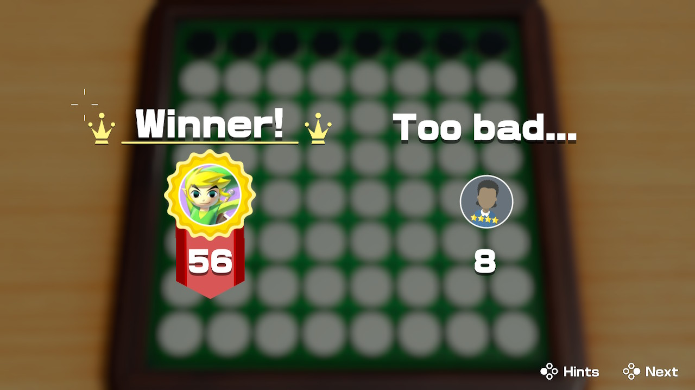

# Renegade - Play online [here](https://poppl.io/renegade)

Here is an AI I made because I could not beat the Clubhouse Games Renegade AI on Impossible difficulty. It still doesn't consistently beat the impossible AI without increasing the depth and branching factors to a high enough number that the moves can take over 30s to evaluate.

It's quite a bit over-engineered - it uses WebAssembly and WebWorkers to find the best move in the background. Still many to-dos but good enough for now.



Move list (have CPU move first):
```
E6 f6
F5 f4
G5 h4
E3 c5
C6 d6
E7 f3
C7 d3
C4 e8
F7 f8
G6 h5
C3 d7
H6 h7
G4 b8
C2 h3
D8 c8
E2 e1
D2 d1
G3 h2
C1 b1
F2 f1
B2 a1
B3 b6
A2 a3
A4 a5
B7 a8
G7 h8
B4 b5
G2 h1
A7 a6
xx g1
xx g2
```


Credits:
- [An Analysis of Heuristics in Othello](https://courses.cs.washington.edu/courses/cse573/04au/Project/mini1/RUSSIA/Final_Paper.pdf) - Vaishnavi Sannidhanam and Muthukaruppan Annamalai
- [A world-championship-level Othello program](https://www.labri.fr/perso/fleury/courses/pdp/Board_Games/Reversi/World-championship-level_othello_program.pdf) - Paul S. Rosenbloom
- [Bitboards](https://www.chessprogramming.org/Bitboards)